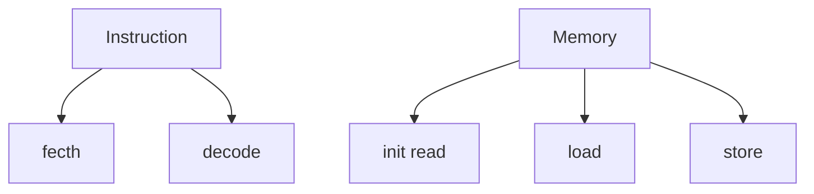
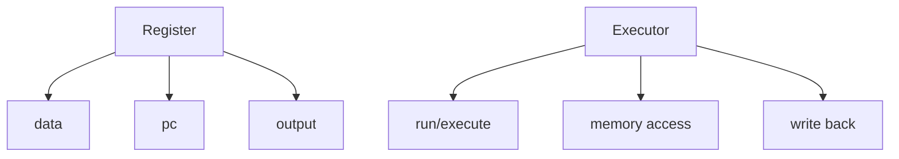
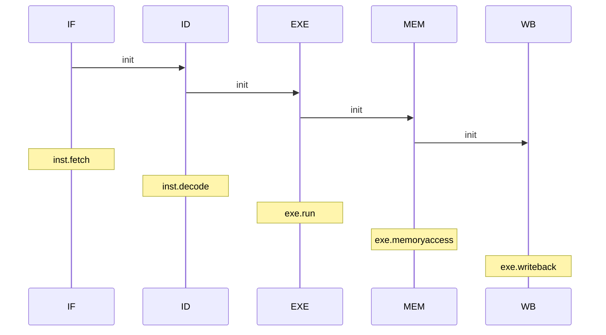

# RISC-V

`to do`

- [x] fix reg[0] bug
- [x] fix execute bug/how execute jal&jalr...
- [x] fix program counter/when to execute next_pc?
- [x] refactor EXE&MEM&WB
- [x] separate instructions executing section(pre)
- [x] mem access(pre)
- [x] writeback(pre)
- [ ] 5-stage pipeline
- [ ] Tomasulo
- [ ] prediction&api
- [ ] various hazards
- [ ] a brief introduction about RISC-V in README
- [ ] and so on……

### 目前版本

一个简易的串行版本

- 基础类

- 流水

### Ver 1.0

> 串行简易版本
>
> 主要实现了reg,mem,inst,exe这3个类

### Ver 1.1

> 串行版本
>
> 在原来的基础上添加了IF,ID,EXE,MEM,WB这5个模块
>
> 优化了执行流程，每一个模块可以嵌入不同的指令

### Ver 2.0

并行版本

~~刚刚开始动工~~

