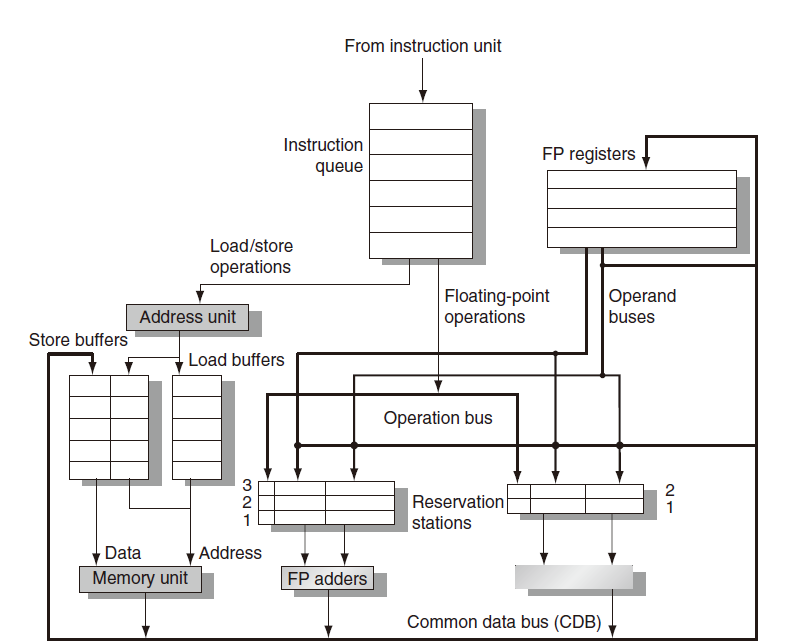
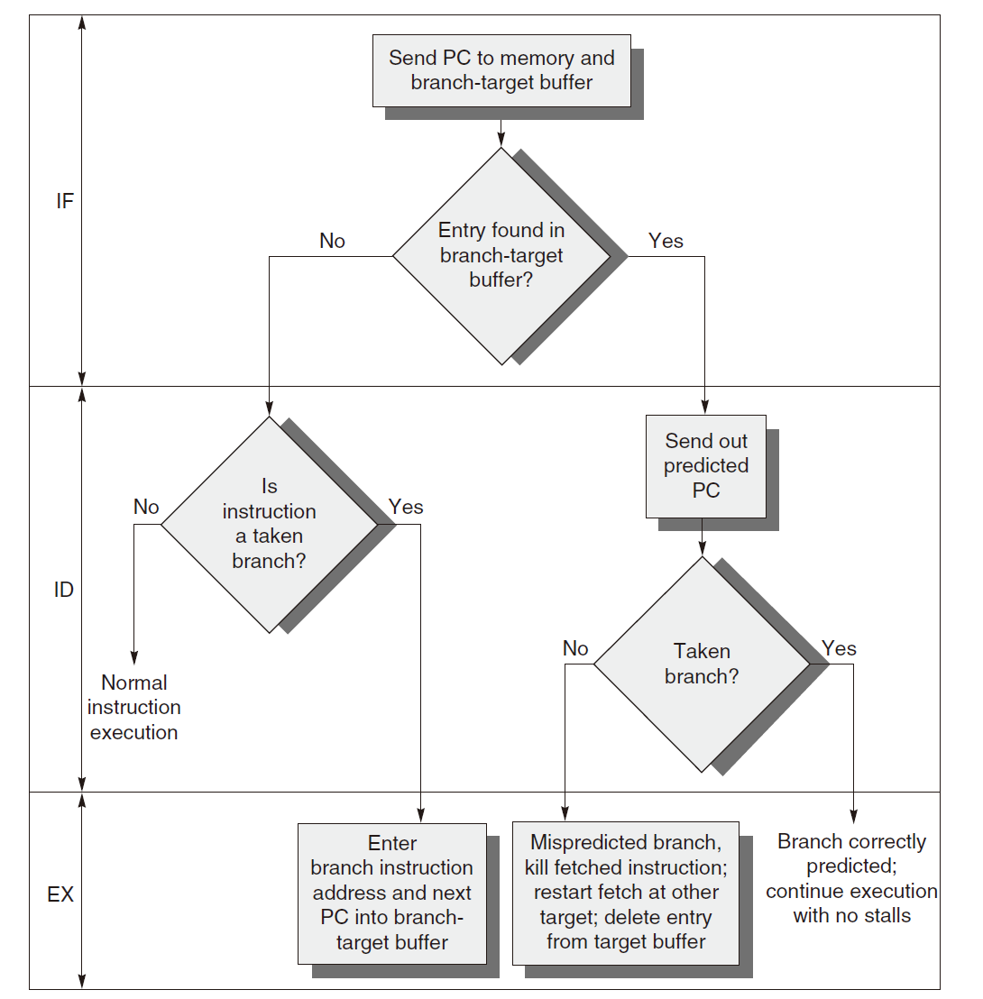
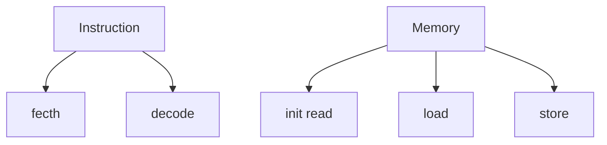
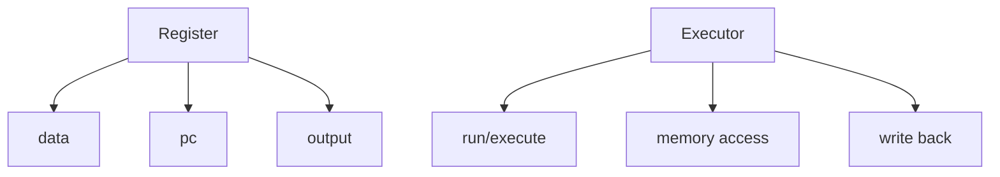
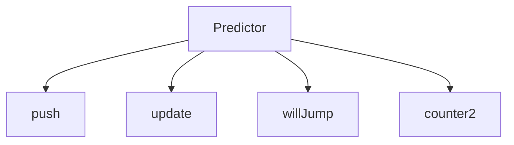

# RISC-V Simulator OoOE

**out-of-order execution** ~~OoO~~

> 在指令issue之后就不存在顺序了

`TODOs`

- [x] Tomasulo
- [x] ROB
- [x] Precise interruption

### 目前版本

Ver1.2

- 流程图

  无法解决访问存储器的WAW/WAR hazard

- 流程图（with ROB）

  顺序发射，乱序执行，顺序提交

- 分支目标缓冲区

  效果似乎相当于一个一位的饱和计数器

  但有buf的话运行起来比计数器快一些

- 基础类

- 主要模块

  - `Issue`

    读取指令，传入Res station，预传入ROB(not ready)

  - `Res staion`

    暂存指令，等待operand出现在CDB后，再将指令传入unit

  - `ALU&SLU`

    执行单元，其中ALU 1 clk，SLU 3 clk，可以带锁

    执行完传入CDB

  - `CDB`

    同一时刻根据指令读取先后进行广播，广播后传入ROB(ready)

  - `ROB`

    重新恢复顺序

    根据指令读取顺序commit

    如果预测错误则会refresh所有模块(精准中断)

### Ver 1.0

Idea

- 执行器分为SLU、ALU，分别为3clk、1clk
- CDB用了priority_queue
- Res station&ROB用了deque
- 单发
- 多次提交

Notice

- ~~遇到了书上没讲的一个bug？~~

  CDB->ROB 会解除reg里Qi

  但如果该指令修改了reg，无法及时commit

  下一条指令用的还是旧的reg....

- 不是很清楚该如何设置时钟周期....

  每个操作的涵盖了5 stage里好的几个阶段

- ~~分支预测的正确率较低~~，原因如下：(其实是我写个了bug，忽略掉这一条，但确实有一定影响)

  只有在commit阶段才会反馈预测器，但是这时候可能已经预测了后续的一些branch inst

  反馈具有延迟性，无法及时更新预测器

- 如果按照循环计算clk的话，这个版本比parallel的确快很多，尽管预测正确率很低

- 遇到store inst&JALR，会暂停到这些指令commit完成

### Ver 1.1

Feature

- 多发(大概是)

Fix

- reg[0]有Qi后从ROB写入的bug
- refresh后没有重置IS.isEmpty

### Ver 1.2

Feature

- 简易的精准中断api

  setStopNum设置中断指令序号

Fix

- predictor反馈过程中的一个bug（~~在重构分支预测的时候发现正确率不会改变~~）

  转跳方式不同于pipeline的差量

  沿用的时候忽略了这个细节，导致一直判定为jump

**运行结果**

既然正确率还行，就不采用分支目标缓冲区了

Notice: clock cycle的计算可能不准确

|           | 时钟周期  |                   |        |
| --------- | --------- | ----------------- | ------ |
| basicopt  | 540023    | 143523/155139     | 92.51% |
| bulgarian | 392672    | 64540/71493       | 90.27% |
| hanoi     | 229873    | 14882/17457       | 85.25% |
| magic     | 741940    | 46004/67869       | 67.78% |
| qsort     | 1459260   | 178825/200045     | 89.39% |
| queens    | 648341    | 60244/77116       | 78.12% |
| superloop | 511915    | 380927/435027     | 87.56% |
| tak       | 2611094   | 48167/60639       | 79.43% |
| pi        | 102689771 | 33483615/39956380 | 83.80% |

