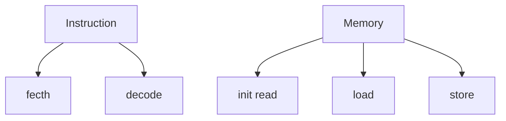
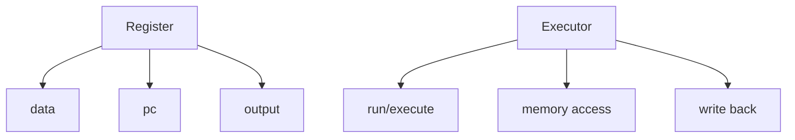
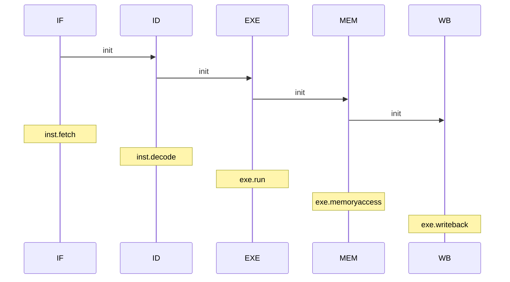

# RISC-V Simulator

`to do`

- [x] fix reg[0] bug
- [x] fix execute bug/how execute jal&jalr...
- [x] fix program counter/when to execute next_pc?
- [x] refactor EXE&MEM&WB
- [x] separate instructions executing section
- [x] mem access
- [x] writeback
- [x] MEM needs 3 clock
- [x] 5-stage pipeline
- [x] data hazard: forwarding
- [ ] control hazard: prediction&api     stall Branch inst later(than JAL&JALR)
- [ ] Tomasulo
- [ ] precise stop (?
- [ ] a brief introduction about RISC-V in README
- [ ] and so on……

### 目前版本

Ver2.1：简易并行版本，~~效率比较低，遇事不决直接stall~~

- 基础类

- 流水模块

### Ver 1.0

> 串行简易版本
>
> 主要实现了reg,mem,inst,exe这4个类

### Ver 1.1

> 串行版本
>
> 在原来的基础上添加了IF,ID,EXE,MEM,WB这5个模块
>
> 优化了执行流程，每一个模块可以嵌入不同的指令

### Ver 2.0

> 简易并行版本，~~效率比较低，遇事不决直接stall~~
>
> feature：
>
> - 增加了wait_clk变量，用来lock模块（putwclk=add wait clk)
>
> - 增加了reset，用于初始化模块
> - 非l&s inst直接传入WB，不经过MEM
>
> 某一个模块被lock时
>
> - 不会run，且每个周期wait_clk-1
>
> - 传出到下一个模块为空，且不会传入上一个模块的结果（对于Ver2.0情况，被lock时上一个模块应该一直为空）
>
> 会引发lock的情况
>
> - ID为control inst，e.g. JAL	结果：IF.reset()，IF.wait_clk=3，即pipeline暂停到cur inst执行完
> - ID为l&s inst，e.g. SB	结果：IF.reset()，IF.wait_clk=6，即pipeline暂停到cur inst执行完
>   - MEM为l&s inst	结果：MEM.wait_clk=3，模拟MEM需要3 clk

### Ver 2.1

> fix：
>
> - ID为l&s inst，只需IF.wait_clk=4，即cur inst完成WB后nxt inst刚好EXE

### Ver 2.2

> feature：
>
> - Forwarding 
>
>   i.e. MEM结果提早返回给EXE
>
>   ID为l&s inst，IF.wait_clk=3