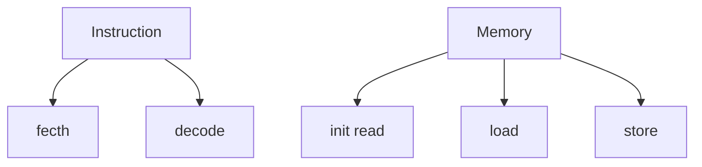
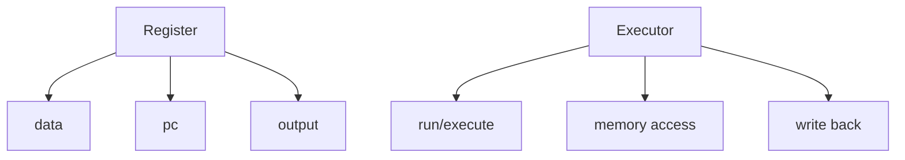
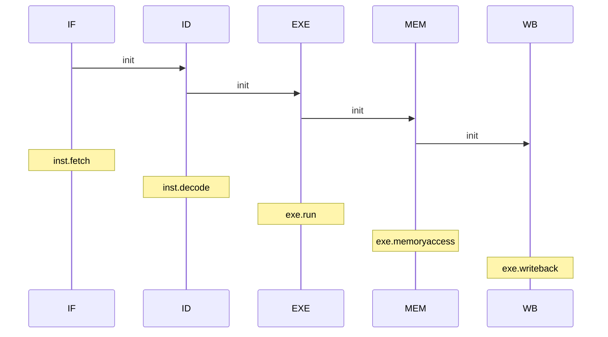

# RISC-V Simulator

`to do`

- [x] fix reg[0] bug
- [x] fix execute bug/how execute jal&jalr...
- [x] fix program counter/when to execute next_pc?
- [x] refactor EXE&MEM&WB
- [x] separate instructions executing section
- [x] mem access
- [x] writeback
- [x] MEM needs 3 clock
- [x] 5-stage pipeline
- [x] data hazard: forwarding
- [x] pc:EXE->IF forwarding
- [x] control hazard: prediction&api   
- [x] optimize prediction
- [x] optimize code runtime (-O3 is enough)
- [ ] Tomasulo
- [ ] precise stop (?
- [ ] a brief introduction about RISC-V in README
- [ ] and so on……

### 目前版本

**Ver3.3**

大概是pipeline的最终版本了

~~其实代码不是很慢，开了O3就很快的（确信）...~~

- 流程图

- 基础类

- 流水模块

### Ver 1.0

> 串行简易版本
>
> 主要实现了reg,mem,inst,exe这4个类

### Ver 1.1

> 串行版本
>
> 在原来的基础上添加了IF,ID,EXE,MEM,WB这5个模块
>
> 优化了执行流程，每一个模块可以嵌入不同的指令

### Ver 2.0

> 简易并行版本，~~效率比较低，遇事不决直接stall~~
>
> feature：
>
> - 增加了wait_clk变量，用来lock模块（putwclk=add wait clk)
>
> - 增加了reset，用于初始化模块
> - 非l&s inst直接传入WB，不经过MEM
>
> 某一个模块被lock时
>
> - 不会run，且每个周期wait_clk-1
>
> - 传出到下一个模块为空，且不会传入上一个模块的结果（对于Ver2.0情况，被lock时上一个模块应该一直为空）
>
> 会引发lock的情况
>
> - ID为control inst，e.g. JAL	结果：IF.reset()，IF.wait_clk=3，即pipeline暂停到cur inst执行完
> - ID为l&s inst，e.g. SB	结果：IF.reset()，IF.wait_clk=6，即pipeline暂停到cur inst执行完
>   - MEM为l&s inst	结果：MEM.wait_clk=3，模拟MEM需要3 clk

### Ver 2.1

> fix：
>
> - ID为l&s inst，只需IF.wait_clk=4，即cur inst完成WB后nxt inst刚好EXE

### Ver 2.2

> feature：
>
> - Forwarding 
>
>   i.e. MEM结果提早返回给EXE
>
>   ID为l&s inst，IF.wait_clk=3

### Ver 2.3

> 修复一个 structural hazard
>
> 由于非s&l不经过MEM，可能同时发生MEM->WB&EXE->WB
>
> 当遇到这种情况时，暂停IF/ID/EXE至下一个clk

### ~~Ver 2.4~~废弃的版本

> > 原话：一个正常写的 .c 编译出来的东西，就不应该会出现这种情况啊
>
> 修复了s inst的一个bug
>
> bug会导致IF先于MEM
>
> 当遇到这种情况时，暂停IF至MEM完成
>
> ~~虽然测试数据里不存在这种bug~~
>
> ~~因为需要魔改代码，于是放弃了forwarding~~

### Ver 3.0

> feature：
>
> - 分支预测
>
>   两位饱和计数器的分支预测
>
>   正确率在40%~70%，平均在55%，~~有时候还不如全部not jump~~

### Ver 3.1

> feature
>
> - 两级自适应预测器
>
>   n=3位分支历史寄存器 [Link]([https://zh.wikipedia.org/wiki/%E5%88%86%E6%94%AF%E9%A0%90%E6%B8%AC%E5%99%A8#%E9%A5%B1%E5%92%8C%E8%AE%A1%E6%95%B0](https://zh.wikipedia.org/wiki/分支預測器#饱和计数))
>
> **部分结果**
>
> |           | 时钟周期  |                   |        |
> | --------- | --------- | ----------------- | ------ |
> | basicopt  | 849203    | 1124171/155139    | 80.04% |
> | bulgarian | 720310    | 57847/71493       | 80.91% |
> | hanoi     | 338960    | 11808/17457       | 67.64% |
> | magic     | 1045278   | 33684/67869       | 49.63% |
> | qsort     | 2544091   | 159121/200045     | 79.54% |
> | queens    | 1036909   | 44465/77116       | 57.66% |
> | superloop | 679496    | 398742/435027     | 91.66% |
> | tak       | 3361545   | 48166/60639       | 79.43% |
> | pi        | 169604990 | 30072875/39956380 | 75.26% |

### Ver3.2

> feature
>
> - 局部分支预测
>
> **n=3结果**
>
> |           | 时钟周期  |                   |        |
> | --------- | --------- | ----------------- | ------ |
> | basicopt  | 821202    | 143523/155139     | 92.51% |
> | bulgarian | 714099    | 64105/71493       | 89.67% |
> | hanoi     | 335378    | 14881/17457       | 85.24% |
> | magic     | 1035835   | 40537/67869       | 59.73% |
> | qsort     | 2543063   | 172174/200045     | 86.07% |
> | queens    | 1027105   | 54078/77116       | 70.13% |
> | superloop | 679496    | 398743/435027     | 91.66% |
> | tak       | 3361545   | 48167/60639       | 79.43% |
> | pi        | 164473580 | 33483615/39956380 | 83.80% |
>
> **n=2结果**
>
> |           | 时钟周期  |                   |        |
> | --------- | --------- | ----------------- | ------ |
> | basicopt  | 819902    | 143351/155139     | 92.40% |
> | bulgarian | 714174    | 64018/71493       | 89.54% |
> | hanoi     | 335378    | 14882/17457       | 85.25% |
> | magic     | 1036177   | 39839/67869       | 58.70% |
> | qsort     | 2530708   | 169657/200045     | 84.81% |
> | queens    | 1031163   | 53313/77116       | 69.13% |
> | superloop | 684460    | 393688/435027     | 90.50% |
> | tak       | 3366930   | 45910/60639       | 75.71% |
> | pi        | 165445912 | 32783691/39956380 | 82.05% |

### Ver3.3

>feature
>
>- 对于B-type inst，增加了EXE->IF的forwarding
>
>**运行时间**
>
>|           | ver3.2    | ver3.3    | serial    |      |
>| --------- | --------- | --------- | --------- | ---- |
>| basicopt  | 821202    | 706597    | 2149669   | 3.04 |
>| bulgarian | 714099    | 616228    | 1473057   | 2.39 |
>| hanoi     | 335378    | 312804    | 725053    | 2.32 |
>| magic     | 1035835   | 949556    | 2400584   | 2.53 |
>| qsort     | 2543063   | 2182015   | 5404772   | 2.48 |
>| queens    | 1027105   | 947307    | 2288274   | 2.42 |
>| superloop | 679496    | 613556    | 2047635   | 3.34 |
>| tak       | 3361545   | 3135134   | 7761183   | 2.48 |
>| pi        | 164473580 | 135050693 | 407940973 | 3.02 |