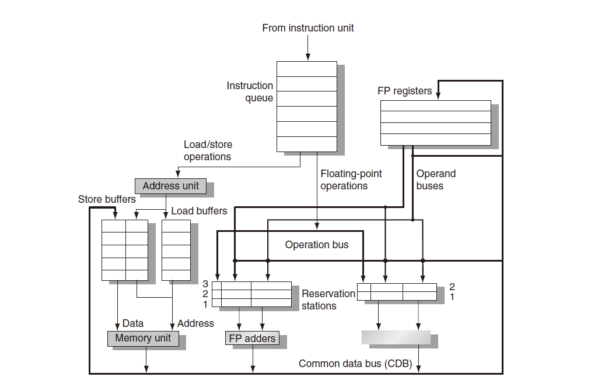
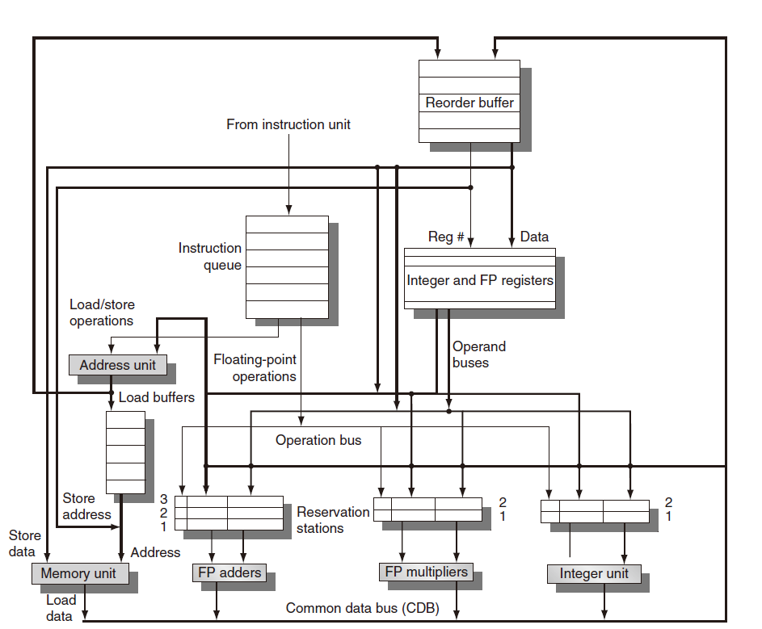
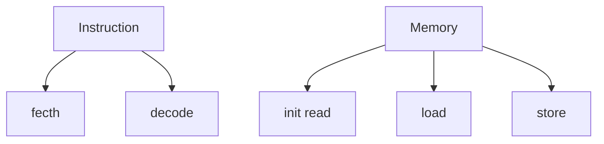
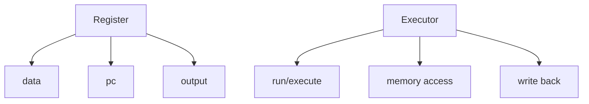
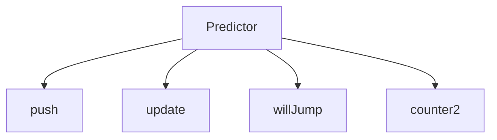

# RISC-V Simulator OoOE

**out-of-order execution** ~~OoO~~

> 在指令issue之后就不存在顺序了

`to do`

- [x] Tomasulo
- [x] ROB
- [ ] precise stop api
- [ ] a brief introduction about Tomasulo&ROB in README
- [ ] and so on……

### 目前版本

ver1.0

Tomasulo:从入门到找不到门

~~我是谁？我在哪？我在写什么？~~

- 流程图

- 流程图（with ROB）

  顺序发射，乱序执行，顺序提交

- 基础类

- 主要模块

  - Issue

    读取指令，传入Res station，预传入ROB(not ready)

  - Res staion

    暂存指令，等待operand出现在CDB后，再将指令传入unit

  - ALU&SLU

    执行单元，其中ALU 1 clk，SLU 3 clk，可以带锁

    执行完传入CDB

  - CDB

    同一时刻根据指令读取先后进行广播，广播后传入ROB(ready)

  - ROB

    重新恢复顺序

    根据指令读取顺序commit

    如果预测错误则会refresh所有模块(精准中断)

### Ver 1.0

> idea
>
> - 执行器分为SLU、ALU，分别为3clk、1clk
> - CDB用了priority_queue
> - Res station&ROB用了deque
> - 单发
>
> notice
>
> - ~~遇到了书上没讲的一个bug？~~
>
>   CDB->ROB 会解除reg里Qi
>
>   但如果该指令修改了reg，无法及时commit
>
>   下一条指令用的还是旧的reg....
>
> - 不是很清楚该如何设置时钟周期....
>
>   每个操作的涵盖了5 stage里好的几个阶段
>
> - 分支预测的正确率较低，原因如下：
>
>   只有在commit阶段才会反馈预测器，但是这时候可能已经预测了后续的一些branch inst
>
>   反馈具有延迟性，无法及时更新预测器
>
> - 如果按照循环计算clk的话，这个版本比parallel的确快很多，尽管预测正确率很低