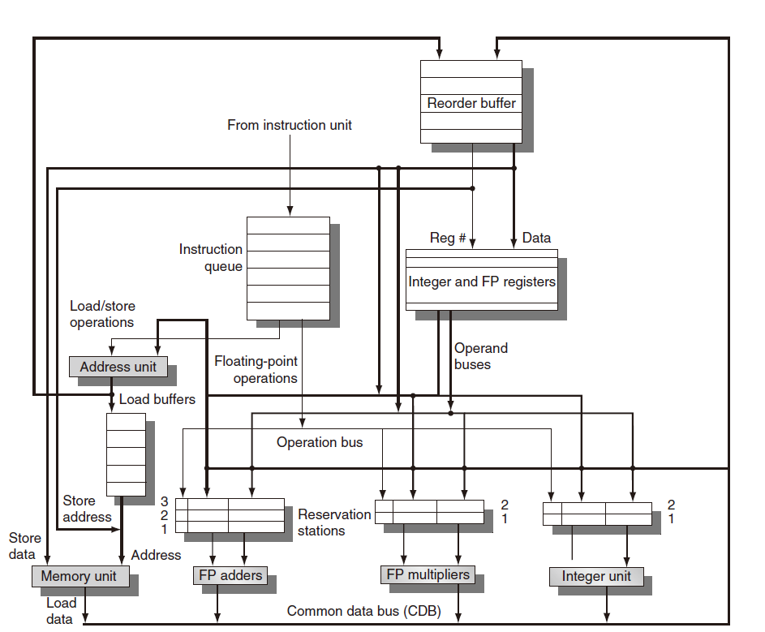

# RISC-V Simulator OoOE

## Description

Out-of-order execution simulator

- [x] Tomasulo Algorithm
- [x] Reorder Buffer

**Vanilla Tomasulo Algorithm Architecture**

NOTE: CAN NOT tackle WAW & WAR hazards of memory access instructions

HACK: stall the whole process when there is a memory write instruction (or JALR)

**Tomasulo Algorithm with Reorder Buffer**

NOTE: sequential issue, out-of-order execute, and sequential commit

**Modules**

- `Instruction Issue`

  Load instructions, and send into `Reservation Station` and `Reorder Buffer`

- `RReservation Staion`

  Reserve instructions until they are ready to execute

- `ALU&SLU`

  Execute instructions

- `Common Data But`

  Broadcast results to `Reservation Station`, and send into `Reorder Buffer`

- `Reorder Buffer`

  Commit instructions in order. If branch misprediction, flush instructions in all modules.

## Toy Results

Assume: `MAX ROB Size = 10`, `MAX_SL_Res = 2`, `MAX_AL_Res = 2`, `NUM_ISSUE_PER = 4`, `ALU Cycle = 1`, `SLU Cycle = 3`

| Test Case | Total Cycles | Branch Prediction | Accuracy |
| --------- | ------------ | ----------------- | -------- |
| basicopt  | 530016       | 127835/155139     | 82.40%   |
| bulgarian | 357350       | 67509/71493       | 94.42%   |
| hanoi     | 233958       | 10664/17457       | 61.08%   |
| magic     | 735320       | 53215/67869       | 78.40%   |
| qsort     | 1223022      | 174888/200045     | 87.42%   |
| queens    | 629673       | 56576/77116       | 73.36%   |
| superloop | 511907       | 408131/435027     | 93.82%   |
| tak       | 2613968      | 44754/60639       | 73.80%   |
| pi        | 102689773    | 32925339/39956380 | 82.40%   |

