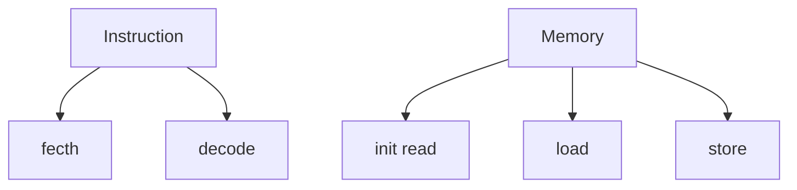
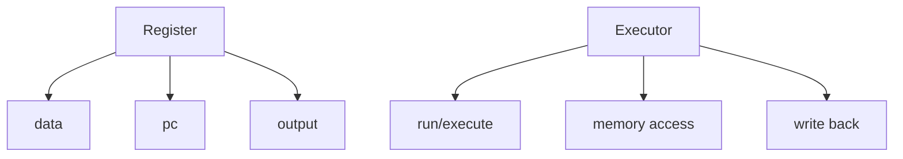
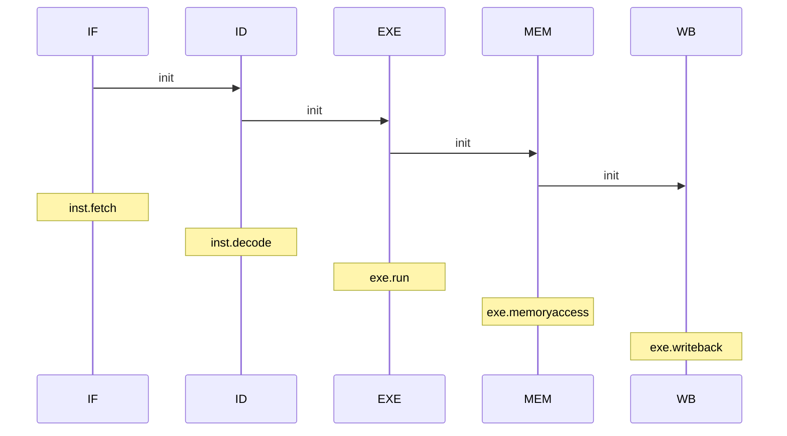

# RISC-V Simulator OoOE

**out-of-order execution** ~~OoO~~

`to do`

- [ ] Tomasulo
- [ ] a brief introduction about Tomasulo in README
- [ ] and so on……

### 目前版本

Tomasulo:从入门到找不到门

- 流程图

- 基础类

- 流水模块

### Ver 1.0

> 未完成
>
> 无控制指令的Tomasulo algorithm