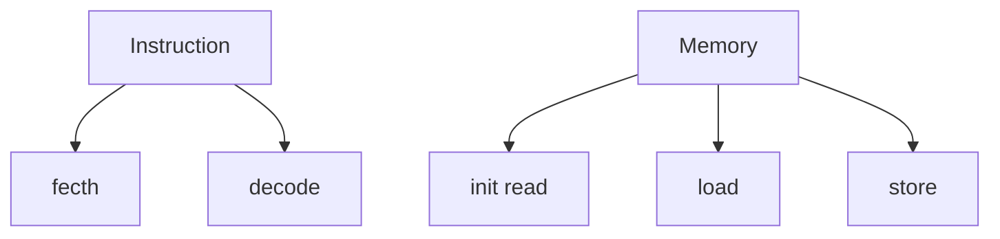
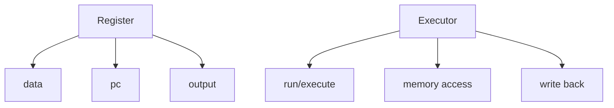
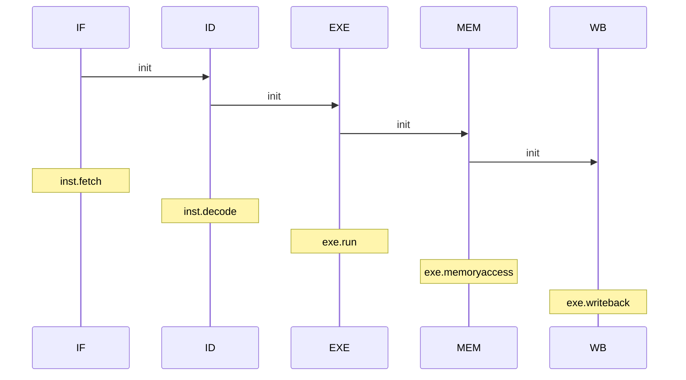

# RISC-V Simulator OoOE

**out-of-order execution** ~~OoO~~

> 在指令issue之后就不存在顺序了

`to do`

- [ ] Tomasulo
- [ ] ROB
- [ ] precise stop api
- [ ] a brief introduction about Tomasulo&ROB in README
- [ ] and so on……

### 目前版本

Tomasulo:从入门到找不到门

~~我是谁？我在哪？我在写什么？~~

- 流程图

- 流程图（with ROB）

  顺序发射，乱序执行，顺序提交

- 基础类

- 流水模块

### Ver 1.0

> idea
>
> - 执行器分为SLU、ALU，分别为3clk、1clk
> - CDB用了priority_queue
> - Res station&ROB用了deque
> - 单发