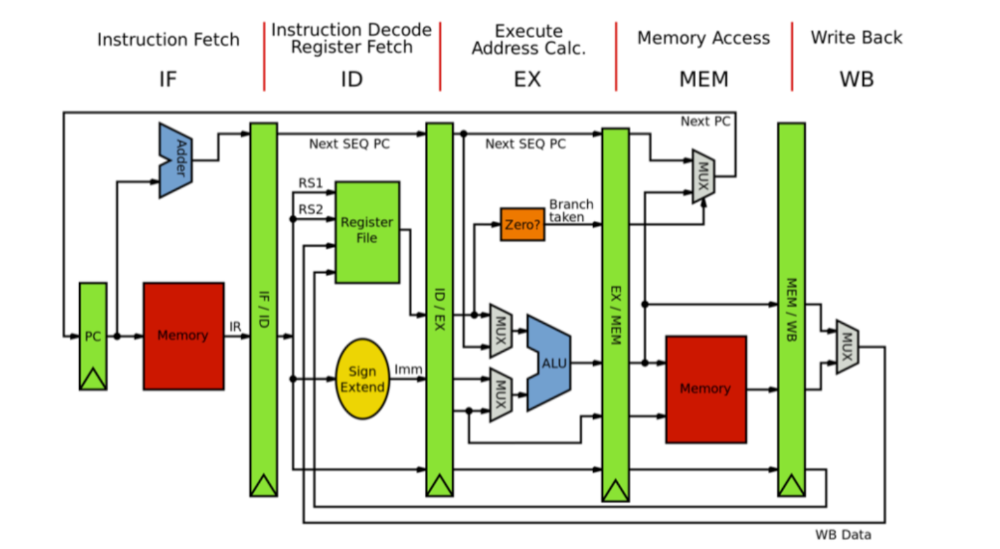

# RISC-V Simulator (pipeline version)

A 5-stage pipeline RISC-V simulator. :hugs: I also wrote a verilog version of this simulator, which is available at [here](https://github.com/CWHer/Arch_labs/tree/main/lab6) (only in Chinese).

### Description

- [x] 5 stages pipeline

- [x] data forwarding

- [x] branch prediction

## Toy Results

Assume: Every stage takes 1 cycle.

| Test Case | Branch Prediction | Accuracy |
| --------- | ----------------- | -------- |
| basicopt  | 145742/190750     | 76.47%   |
| bulgarian | 78123/91458       | 85.64%   |
| hanoi     | 16295/28207       | 57.69%   |
| magic     | 68266/89279       | 76.43%   |
| qsort     | 217605/268671     | 80.93%   |
| queens    | 70293/99701       | 70.58%   |
| superloop | 418187/445087     | 94.04%   |
| tak       | 120549/197071     | 61.20%   |
| pi        | 34051543/42208788 | 

|           | Pipeline  | Serial    | Ratio |
| --------- | --------- | --------- | ----- |
| basicopt  | 909910    | 2589875   | 2.85  |
| bulgarian | 516129    | 1485510   | 2.88  |
| hanoi     | 258751    | 706790    | 2.73  |
| magic     | 816620    | 2352370   | 2.88  |
| qsort     | 2065962   | 5711170   | 2.77  |
| queens    | 800866    | 2247330   | 2.80  |
| superloop | 615669    | 2559495   | 4.16  |
| tak       | 2441275   | 6972975   | 2.86  |
| pi        | 171037901 | 507803615 | 2.97  |